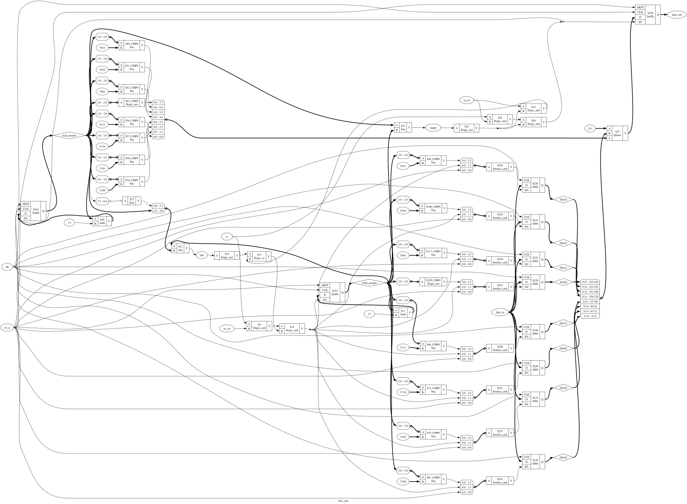

# 8-Bit Synchronous FIFO — SkyWater 130nm ASIC Implementation

A fully-verified 8-bit Synchronous FIFO designed in Verilog HDL and physical implementation through **OpenLane** using the **SkyWater 130nm PDK (`sky130A`)**.

---

## 📌 Architecture & Design Overview
* **Depth / Width:** 8-bit wide data path
* **Clock Domain:** Single synchronous clock (`clk`) with active-low asynchronous reset (`rst_n`)
* **Control Flags:** Full (`full`) and Empty (`empty`) status indicators
* **PDK Target:** `sky130_fd_sc_hd` (High Density Standard Cells)

---

## 🎨 Gate-Level Schematic


---

## 📐 Physical Design Specifications (OpenLane Signoff)

| Parameter | Specification / Result |
| :--- | :--- |
| **Process Node** | SkyWater 130nm (`sky130A`) |
| **Die Area** | $200 \times 200\ \mu\text{m}$ |
| **Target Clock Frequency** | 100 MHz (10.0 ns period) |
| **Setup / Hold Violations** | **0** (Clean Signoff) |
| **DRC / LVS** | **0 Violations** (Passed) |

---

## 📁 Repository Structure
```text
sync-fifo-verilog/
├── fifo_sync.v            # RTL Implementation
├── fifo_sync_tb.v         # Testbench
├── fifo_schematic.svg     # Yosys RTL Schematic
├── config.json            # OpenLane Flow Configuration
├── physical_design/
│   ├── fifo_sync.gds      # Final Signoff GDSII Layout
│   ├── 31-rcx_sta.checks.rpt # Static Timing Analysis Report
│   └── manufacturability.rpt # Manufacturability & DRC Summary
└── README.md
# Compile Verilog RTL and Testbench
iverilog -o fifo_sim fifo_sync.v fifo_sync_tb.v

# Execute Simulation
vvp fifo_sim

# View Waveforms
gtkwave fifo_tb.vcd
# Ensure OpenLane Docker environment is active
cd ~/OpenLane
./flow.tcl -design fifo_sync
---

### Step 4: Update `.gitignore`

Ensure temporary build files remain excluded from future commits:

```bash
cat << 'EOF' > .gitignore
# Ignore OpenLane build runs
runs/

# Ignore simulation binaries and history
*.vvp
*.vcd
*.out
*.history
abc.history

# Ignore massive library files and raw binary dumps
*.lib
*.png
